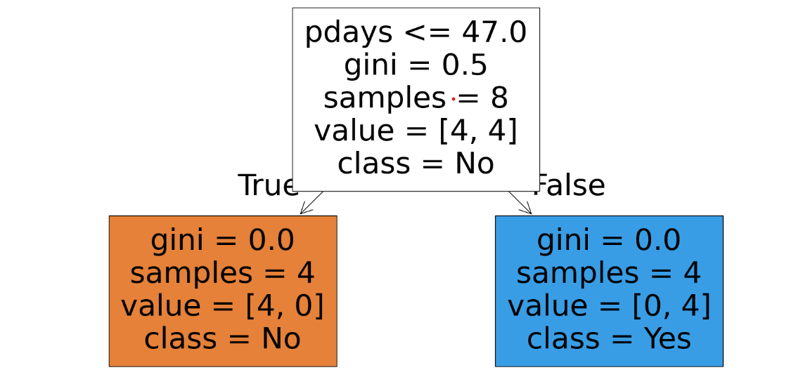

# 🌳 Task 3 - Decision Tree Classifier

## 📁 Folder: Task3_DecisionTree

---

### 📌 Objective

The goal of this task is to build a **Decision Tree Classifier** to predict whether a customer will purchase a product or service based on their demographic and behavioral attributes. The model uses the **Bank Marketing dataset** from the **UCI Machine Learning Repository**.

---

### 📊 Dataset Overview

**Filename:** `bank.csv`  
**Separator:** Semicolon (`;`)  
**Source:** UCI Machine Learning Repository - Bank Marketing Dataset  
**Target Variable:** `y` (purchase decision)

**Key Features:**
- `age`
- `job`
- `marital`
- `education`
- `default`
- `balance`
- `housing`
- `loan`
- `contact`
- `day`, `month`, `duration`, `campaign`, `pdays`, `previous`
- `poutcome`

---

### 🔍 Steps Performed

1. Imported and explored the dataset.
2. Handled categorical features using Label Encoding.
3. Split the dataset into training and testing sets.
4. Trained a **Decision Tree Classifier** using `scikit-learn`.
5. Evaluated the model with accuracy score and classification report.
6. Visualized the decision tree.

---

### 📈 Sample Output

**Decision Tree Plot:**

**Accuracy Chart or Confusion Matrix (Optional):**

---

### 🧪 Tools & Libraries

- Python
- Pandas, NumPy
- Scikit-learn (DecisionTreeClassifier, train_test_split, metrics)
- Matplotlib / Seaborn for visualization
- Google Colab

---

### 📎 Files Included

- `bank.csv` – Dataset file
- `Task3_DecisionTree.ipynb` – Jupyter Notebook
- `tree_plot.png` – Decision tree visualization
- `README.md` – This file

---

### 👩‍💻 Submitted by

**Srishti Aggarwal**  
SkillCraft Technology – Data Science Internship  
Task 3 of `SCT_DS_Internship2025`
