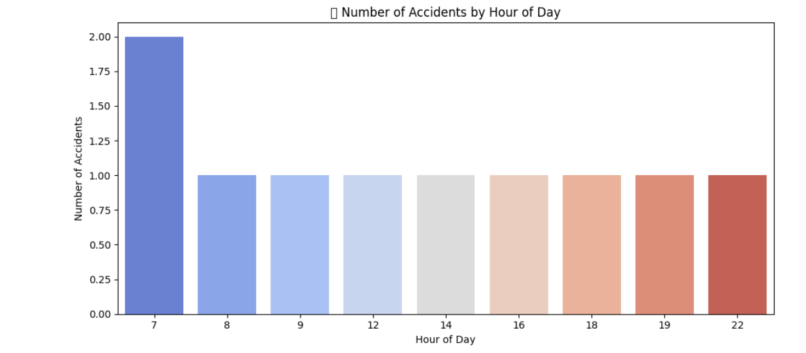
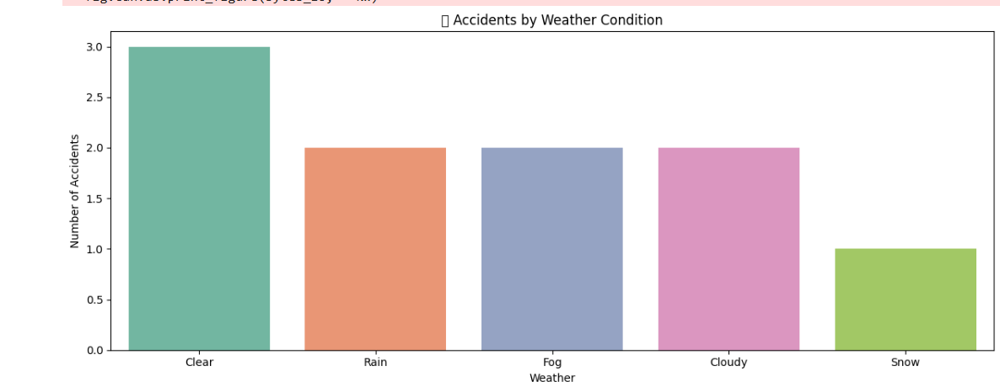
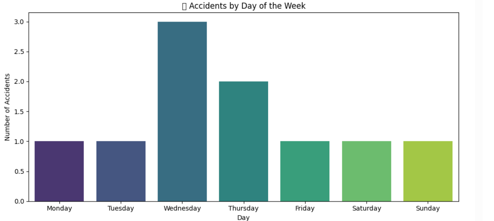
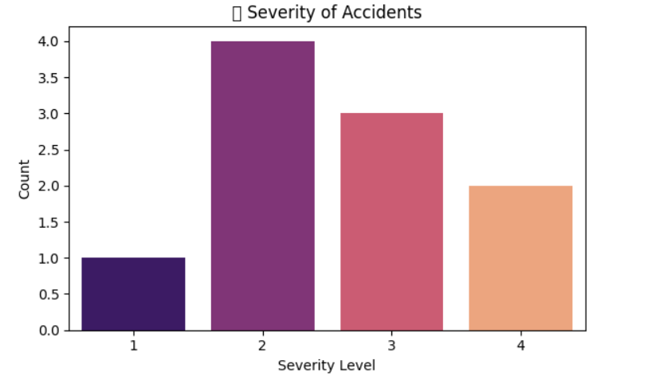

# 🚦 Task 4 – Traffic Accident Analysis

## 📌 Objective

Analyze traffic accident data to uncover patterns related to:
- 🛣️ Road conditions
- 🌧️ Weather
- 🕒 Time of day

Also visualize:
- ⚠️ Accident hotspots
- 📊 Contributing factors

---

## 📁 Dataset

**File Name:** `accidents.csv`  
**Source:** Uploaded manually  
**Columns Used:**
- `Start_Time` – Timestamp of the accident
- `Weather_Condition`
- `Road_Condition` *(if present)*
- `Severity`
- Other time-based features derived from `Start_Time`

---

## 🔍 Steps Performed

1. **Loaded and cleaned** the dataset (`null values` removed)
2. Extracted:
   - Hour of accident
   - Day of week
3. **Visualized** accident trends using `Seaborn` and `Matplotlib`
4. Saved a **cleaned version** as `accidents_cleaned.csv`

---

## 📊 Visualizations

### 1. Accidents by Hour of Day

---

### 2. Accidents by Weather Condition

---

### 3. Accidents by Road Condition

---

### 4. Accidents by Day of Week

---

### 5. Severity Distribution

---

## 🧹 Output Files

- `accidents_cleaned.csv` – Cleaned and ready for further analysis
- PNG images – For visual interpretation of insights

---

## 🧠 Conclusion

This analysis helped identify:
- Peak accident hours (e.g., rush hours)
- Bad weather effects (e.g., rain, fog)
- Critical road conditions contributing to higher severity
- Weekly trends (e.g., Monday blues or weekend spikes)

These insights can be useful for city planning, law enforcement, and public safety strategies.

